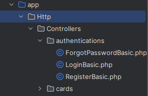
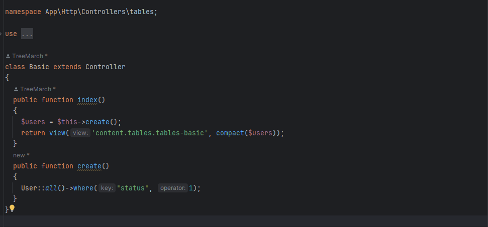

Đầu tiên là về cách chúng nó chia folder.

_**Trong Controller**_
-
- Tên folder không viết hoa.
- Tên folder _**controller**_ nối với nhau bằng dấu "_" (shift + -).
- Class Controller thì **_coding convention giống hệt Java_**, không có dấu nối và viết Hoa ký tự đầu của một từ.
- Function viết trong class cũng phải bắt đầu là một động từ và không viết hoa từ đầu tiên (trừ cái index).
- Tương tự trong "Models" và "Providers" cũng thế.

**_Trong views_**
-
- Tên folder không viết hoa.
- Folder nối với nhau bằng dấu "-".
- File "blade.php" cũng không viết hoa và nối với nhau bằng dấu "-";
- Trong phần views đã có hầu hết UI thường dùng, nên dùng sẵn những gì nó cho.

- _Folder "partials" không cần quan tâm, Folder content "content" toàn bộ các components của website, Folder "layouts" chứa các loại Navbar và footer_

- _Nếu cần thêm một trang rỗng chưa có nội dung gì hay đơn giản là custom một trang mới thì sử dụng file "blankLayout.blade.php" nằm trong folder "views/layouts/blankLayout.blade.php"_

**_Trong các folder khác_**
-
- Trong các folder khác không nên động vào vì có thể liên quan đến môi trường nó chạy hoặc cách chúng nó link với nhau.
- _Không nghịch CSS và JS trong phần resources/assets_

- Trong trường hợp muốn custom JS, CSS thì dùng file "app.js" và "app.css" trong resources/(css hoặc js)

- Còn cần thêm hình ảnh thì thay đổi trong "public/assets/img"

- Nếu thiếu thư viện thì thêm trong "commonMaster.blade.php" trong folder "views/layouts/commonMaster.blade.php"

**_Trong này cái luồng chúng nó chia theo kiểu là:_**
-

Route ---> Controller (controller này chỉ là controller ui, tức là chỉ có giao diện thôi, những cái này nó tạo sẵn ra cho mình để sử dụng lại như 1 cái template) ---> Trong mỗi cái controller này chúng m sẽ thấy là nó trả về mỗi cái view thôi cái view đấy thì là file blade.php rồi.

Thì ở đây mình có 2 cách viết và quan trọng là phải thống nhất có thể mình sẽ chọn phải cách viết không nên nhưng mà ít nhất mình thống nhất được với nhau thì sẽ hạn chế việc loạn thông tin.

**_Tạo một Controller mới để x lý phần Logic. Tức là mình có 2 Controller, 1 cái xử lý UI, 1 cái xử lý logic_**

**_Ví dụ về cách làm việc với một Controller_**
-
Trong trường hợp này là function create:

- Đây là phía Controller
- _**Lưu ý là trông function create nó hơi ngu nhưng anh cần nó ngu như này cho dễ hiểu và mỗi function chỉ thực hiện duy nhất 1 chức năng**_

- Giải thích cách anh viết là: Function create nó có duy nhất 1 chức năng là sử dụng Models User để find all User, Sau đây gắn cái $users = create().
- Cuối cùng là return lại 1 cái views("...", compact($users)), cái compact này là nó truyền giá trị từ cái $users vào cái views, và để mình sẽ truy cập được cái "$users" này trong view

Đây là xử lý phía "blade.php":

- Mình sẽ dùng @foreach() để load ra tất cả giá trị tương ứng
